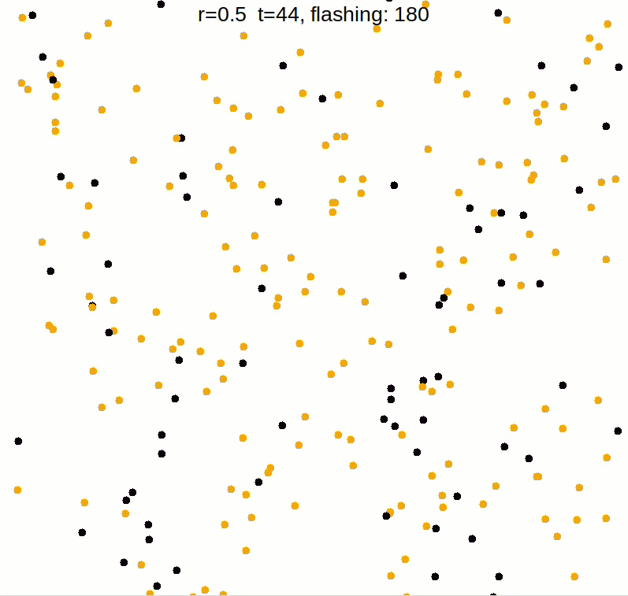
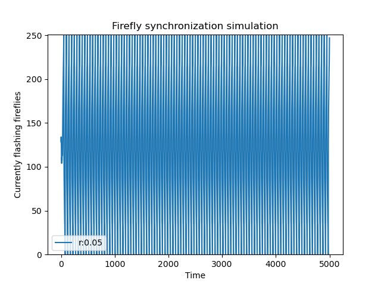
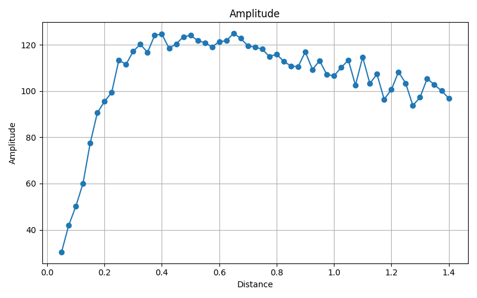

# Firefly Synchronization

## Table of Contents
- [The idea](#the-idea)
- [Structure](#structure)
- [Animation](#animation)
- [Usage](#usage)
- [Results](#results)
  - [sync_over_time_0.05.png](#sync_over_time_005png)
  - [amplitude_sweep.png](#amplitude_sweeppng)

## The idea

This project explores **spontaneous synchronization** - the phenomenon where a
large group of independent, identical oscillators, each only weakly coupled to
its nearby neighbours, ends up flashing in perfect unison without any central
coordinator. The classic real-world example is fireflies: thousands of
individual insects, each just watching the fireflies around them, gradually
lock onto the same rhythm and the whole swarm starts flashing together.

The model used here follows the Mirollo-Strogatz idea of pulse-coupled
oscillators: each firefly runs its own flash cycle, and after every full cycle
it nudges its own timing forward or backward depending on whether most of its
neighbours (within some radius `r`) were flashing "early" or "late" relative
to it. Repeat this over many cycles and, above a certain coupling radius,
the whole swarm snaps into sync - purely from local interactions, no firefly
knows about the swarm as a whole.

None of the fireflies in this simulation communicate directly, send messages,
or know anything about the swarm as a whole. Each one only has **local
information** 

The project looks at this from three angles:
- **Animation** - watch the swarm synchronize live.
- **Time-series analysis** - how many fireflies are flashing at once, over
  time, for a few different coupling radii.
- **Amplitude sweep** - across a full range of coupling radii, how strongly
  does the swarm end up synchronizing?

## Structure
- `animation/` - real-time visualization of the synchronization process
- `analysis/` - quantitative analysis of how the coupling radius affects
  synchronization amplitude (Python + C implementation for performance)
- `analysis/results/` - example output plots from the analysis scripts

## Animation

Live view of the swarm: each dot is a firefly, flashing orange when active. Starting from random, uncoordinated flashing, the swarm gradually locks into a shared rhythm as fireflies nudge their own timing based only on their local neighbours.

## Usage
Only execute Python scripts directly. Install any missing libraries as needed.

    python <script>

Python will tell you which library is missing. To install:

**Linux:**

    pip install <lib>

**Windows:**

    python -m pip install <lib>

### Note on `analysis/`
Don't execute the C binary directly - it's invoked automatically by
`amplitude_sweep_plot.py`.

To build it yourself first:

    gcc amplitude_sweep.c -o amplitude_sweep -lm

## Results

### `sync_over_time_0.05.png`

This plots the number of currently-flashing fireflies (out of 250) against
time, for a small coupling radius (`r = 0.05`). At this radius, each firefly
only sees a handful of close neighbours, so there isn't enough shared
information for the swarm to lock together. The flashing count oscillates
somewhat but never settles into a clean, high-amplitude rhythm - the swarm
stays largely desynchronized, with the flashing count wandering rather than
swinging cleanly from "all flashing" to "none flashing."

Compare this against the larger-radius plots in the same folder
(`sync_over_time_0.5.png`, `sync_over_time_1.4.png`): as `r` grows, each
firefly has more neighbours to align with, and the flashing count increasingly
swings in a clean square-wave pattern between (almost) all 250 fireflies
flashing at once and none flashing at all - a clear sign the swarm has
synchronized.

### `amplitude_sweep.png`

This plot summarizes the same effect but across the *entire* range of
coupling radii (`r` from 0.05 to 1.4) in a single chart. For every value of `r`, the swarm is
simulated repeatedly, and the **amplitude** - half the difference between the
maximum and minimum number of simultaneously-flashing fireflies in the last
50 cycles - is recorded and plotted against `r`.

- Low amplitude means the flashing count barely moves - the swarm is not
  synchronized.
- High amplitude (approaching half the swarm size, ~125) means the flashing
  count swings all the way from "everyone flashing" to "no one flashing" -
  the swarm is fully synchronized.
