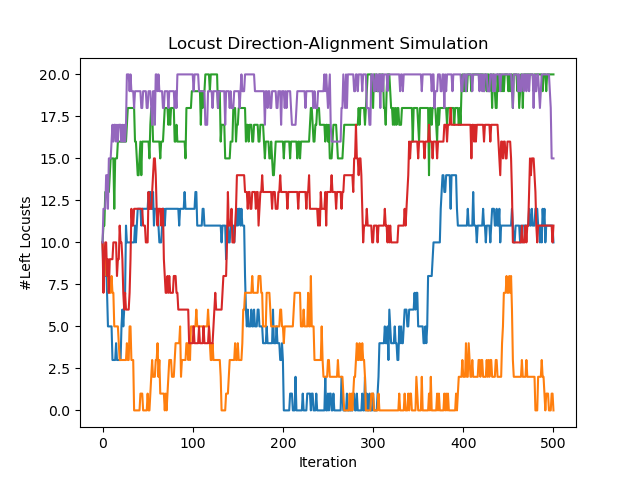
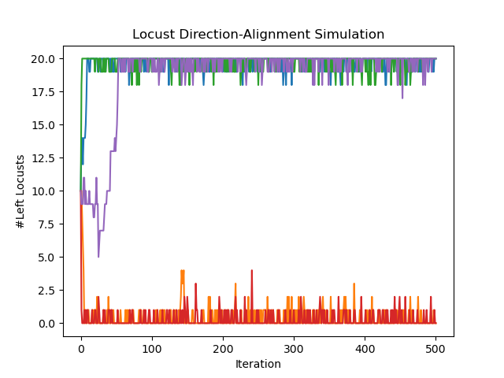
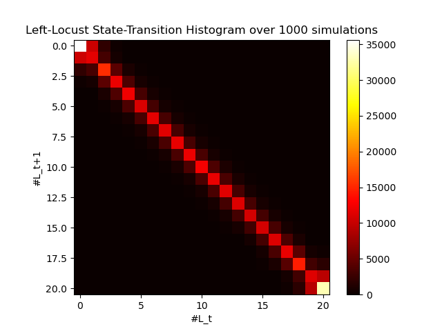
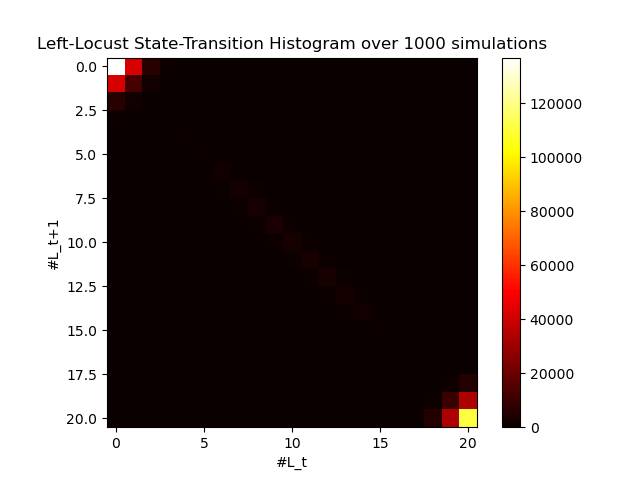
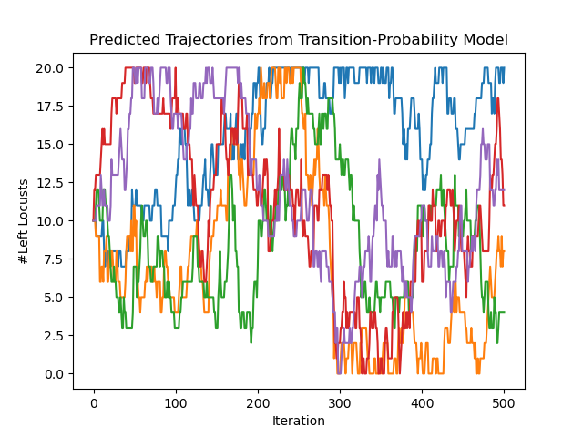
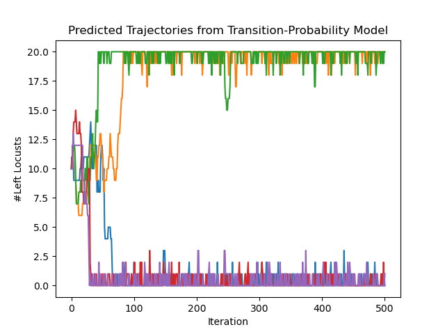

# Locust Alignment

## Table of Contents
- [The idea](#the-idea)
- [Structure](#structure)
- [Usage](#usage)
- [Results](#results)

## The idea

Locusts move around a ring, each holding a left- or right-moving direction.
At every step, a locust looks at nearby neighbours within some perception
range: if most of them are moving the opposite way, it switches direction
(there's also a small constant chance of switching regardless, to keep things
from getting stuck). The question explored here is whether this simple,
local rule causes the whole swarm to converge on a shared direction, or
whether it stays split.

Three variants are compared:
- **Normal** - swarm starts an even 10/10 split.
- **Biased** - swarm starts at an 8/12 split instead.
- **High view distance** - locusts can perceive further, so each one reacts
  to a much larger group of neighbours.

Beyond directly simulating locusts, this project also builds a **transition
probability model**: by running many simulations and recording how often the
group goes from *N* left-movers to *M* left-movers in one step, an
empirical transition histogram is built. This model can then generate new
trajectories on its own, without simulating a single locust.

## Structure
- `locust_alignment.py` - the simulation, transition-model builder, and
  plotting code
- `results/` - example output plots

## Usage
Only execute Python scripts directly. Install any missing libraries as needed.

    python locust_alignment.py

## Results

| Normal | High view distance |
|:---:|:---:|
|  |  |
| swarm never fully agrees on a direction | swarm reliably converges to one shared direction |

With the default (small) perception range, the number of left-moving locusts
wanders back and forth over time and never settles - the swarm stays mixed.
Increasing the perception range (so each locust reacts to a much larger
neighbourhood) is enough to flip this: the swarm quickly and reliably
converges to everyone moving the same way. The `_biased` variants show the
same pattern starting from an uneven initial split.

The transition-histogram and predicted-trajectory plots
(`transition_histogram_*` and `predicted_trajectories_*` in `results/`) show
the same effect from the modeling side: the learned transition probabilities
are symmetric and centered for the non-converging case, but skewed toward the
extremes (all-left / all-right) once the perception range is increased - and
trajectories sampled purely from these probabilities reproduce the same
convergence behaviour as the original simulation.

### Transition histogram

| Normal | High view distance |
|:---:|:---:|
|  |  |
| probability mass centered on "stay the same" | probability mass pulled toward the extremes |

Each histogram plots, over 1000 simulations, the probability of going from
*N* left-movers at time *t* to *M* left-movers at time *t+1*. In the normal
case, the brightest cells sit right on the diagonal - the most likely outcome
at any point is simply "stay at the current count," and the distribution is
symmetric around the middle, which is exactly why the swarm never commits to
one direction. With a higher perception range, that symmetry breaks: the
histogram brightens near the corners (0 and 20 left-movers), meaning that
once the swarm starts leaning one way, it becomes increasingly likely to keep
moving further in that direction rather than drifting back - the mechanism
behind the convergence seen in the trajectory plots above.

### Simulation vs. predicted trajectories

Since both approaches still start from a randomized initial state, this is
best read as a comparison of overall behaviour and trends rather than a
step-by-step match - what matters is whether the two methods tell the same
story about how the swarm evolves, not whether individual runs line up
exactly.

| Actual simulation | Predicted from histogram |
|:---:|:---:|
|  |  |
|  |  |

The predicted trajectories are generated purely by sampling from the learned
transition histogram, one step at a time - no individual locust is ever
simulated. Despite that, they reproduce the same qualitative behaviour as the
real simulation in both cases: wandering, unconverged paths for the normal
perception range, and fast convergence to one extreme (all-left or
all-right) for the high view distance case. This is a useful sanity check on
the transition model - it confirms the simplified, population-level
description captures the same dynamics as tracking every individual locust.
