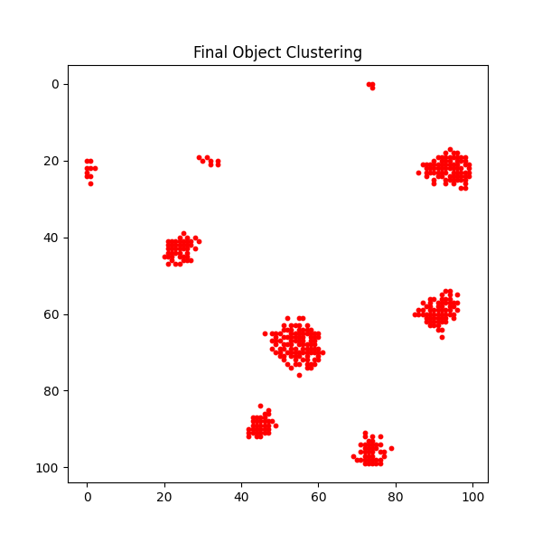
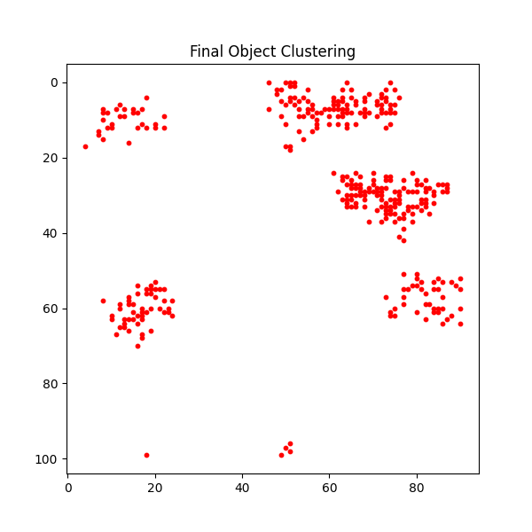
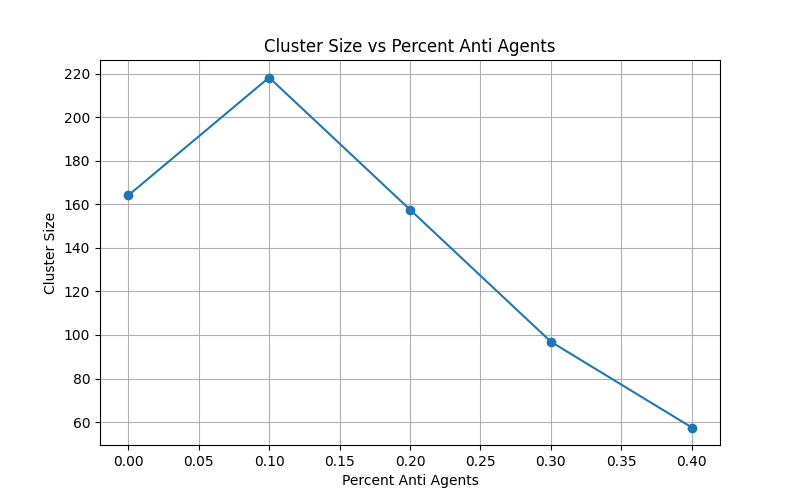

# Wood Chip Clustering (Ant Aggregation)

## Table of Contents
- [The idea](#the-idea)
- [Structure](#structure)
- [Animation](#animation)
- [Usage](#usage)
- [Results](#results)
  - [Dispersion by anti-agent percentage](#dispersion-by-anti-agent-percentage)
  - [Cluster size vs. anti-agent percentage](#cluster-size-vs-anti-agent-percentage)

## The idea

None of the agents in this simulation communicate directly, plan ahead, or
know anything about the swarm as a whole. Each one only has **local
information** - it can only sense object density in a small radius around
itself, and reacts with a simple probability rule based on what it currently
sees. There is no leader, no shared map, and no coordination beyond this local
sensing. This project explores how a **self-organizing system** of very
simple agents can still produce coherent, swarm-wide clustering behaviour.

The model is based on **ant aggregation / brood-sorting behaviour**: each
agent wanders randomly across a grid scattered with objects ("wood chips").
An agent that isn't carrying anything is more likely to pick up an object if
the local density around it is *low*, and an agent that is carrying an object
is more likely to drop it if the local density around it is *high*. Repeated
over many agents and many steps, this simple pick-up/drop-off rule is enough
to pull scattered objects into clusters - again, purely from local
interactions.

On top of the normal agents, this project also introduces **anti-agents**:
agents with the *exact opposite* pick-up/drop rule (more likely to pick up in
dense areas, more likely to drop in sparse areas). Individually, an anti-agent
actively works against clustering. The interesting question this project
explores is: **can a small number of anti-agents actually help the swarm form
better clusters overall** - a form of emergent cooperation between agents whose
individual behaviours directly oppose each other?

## Structure
- `animation/` - real-time visualization of the clustering process (see
  below), plus recorded GIFs comparing the with/without anti-agent cases
- `simulation/` - the agent-based simulation, in both Python (for
  visualization) and C (for fast, repeated batch runs used in the analysis)
- `analysis/results/` - example output plots from running the simulation
  under different settings

## Animation

| No anti-agents | 10% anti-agents |
|:---:|:---:|
|  |  |
| objects settle into many small, separate clusters | a small fraction of agents working "against" clustering locally ends up helping consolidate the objects into fewer, larger clusters |

## Usage
Only execute Python scripts directly. Install any missing libraries as needed.

    python <script>

Python will tell you which library is missing. To install:

**Linux:**

    pip install <lib>

**Windows:**

    python -m pip install <lib>

### Note on `simulation/`
Don't execute the C binary directly - it's invoked automatically by
`clustering_sim.py` when running the anti-agent percentage sweep.

To build it yourself first:

    gcc clustering_sim.c -o clustering_sim -lm

## Results

### Dispersion by anti-agent percentage

| 0% anti-agents | 70% anti-agents |
|:---:|:---:|
|  |  |
| tight, well-formed clusters | pushed apart into loose, scattered groups |

*(click an image to view it full-size)*

These plots show final object positions after 100k simulation steps, for
different percentages of anti-agents (`analysis/results/dispersion_by_percentage/`
contains the 0%, 10%, 30%, and 70% cases; settings used are in `settings.txt`
in the same folder). At 0% anti-agents, objects form clearly separated, tight
clusters - the classic ant-aggregation result. As the percentage of
anti-agents increases, their opposing pick-up/drop behaviour increasingly
disperses the objects: clusters get looser and more spread out, until at 70%
anti-agents the objects are pushed apart almost as much as they're pulled
together, and the clean clustering effect breaks down.

### Cluster size vs. anti-agent percentage

This plot (averaged over 100
iterations per setting) tracks the size of the *largest* cluster as the
percentage of anti-agents increases. Rather than cluster size simply
decreasing as more anti-agents are added, there's a **peak around 10%
anti-agents** where the largest cluster is actually bigger than with no
anti-agents at all. Past that point, cluster size drops off sharply as
dispersion (shown above) starts to dominate.

The interpretation: a small fraction of anti-agents seems to help break up
small, sub-optimally placed clusters, freeing up those objects to be
re-collected into the swarm's larger, dominant cluster - a case of two
locally-opposed behaviours combining into a net benefit for the group.
Beyond a certain anti-agent percentage, though, the disruptive effect
overwhelms the benefit and just spreads everything out.

**Caveats:** these results come from limited compute (100k steps, 100
iterations per data point), so they should be read as a suggestive trend
rather than a firm conclusion. Repeated runs of the same setting (see
`cluster_size_vs_anti_agent_wide.png` and `cluster_size_vs_anti_agent_zoomed.png`,
both from the same configuration) showed the same peak-around-10% trend each
time, which is encouraging, but a longer/more thorough sweep would be needed
to confirm it holds robustly. Some other settings that were tried
(`tight_cluster_d1.png`, `sparse_cluster_d4.png`,
`sparse_cluster_d4_more_objects.png`) didn't show a clear anti-agent benefit,
so the effect appears sensitive to the exact clustering-distance and
population parameters used.
